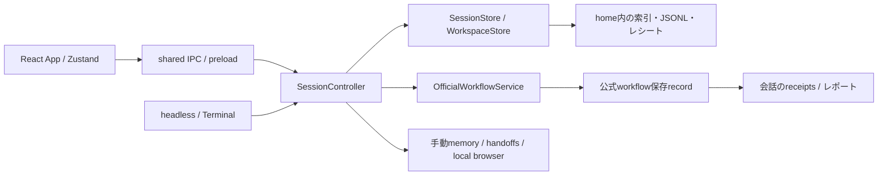

# 会話・利用者操作の設計（How）

基準: 2026-10-09、`0e5fa40da0d8bc39b71fb36b83cce82a8fe18087`。背景は [Requirements](../Requirements.md)、外部仕様と受入条件は [Spec](../Spec.md)。ここでは会話と保存・表示・手動管理の責務を説明する。モデルAdapter、計画/承認の実行条件、skills bundleの実装は専門仕様を参照する。

## 1. 責務と経路

[SessionController](../../../src/main/session/controller.ts)は会話選択、登録workspace、runtime状態、準備/停止/削除、手動commandを束ねる。通常送信は公式submissionへ渡し、旧HTTP、旧Agent Loop、旧モデルツールへfallbackしない。手動管理に旧validatorの名前が残っても公開モデルツールは0である。

GUIは[App](../../../src/renderer/App.tsx)と[Zustand store](../../../src/renderer/state/store.ts)でmainからのstate/transcript/turn等を投影する。sharedのcommand parserをmainで使い、rendererの状態を承認・所有の根拠にしない。headlessも同じController/serviceを使用し、端末だけが入力/出力と承認プロンプトを管理する。

## 2. 会話・作業場所の所有

[WorkspaceStore / SessionStore](../../../src/main/session/store.ts)がhome内にworkspace登録と会話metadataを保存する。workspaceにはrootとID、会話にはworkspaceIdとcwdを持たせる。cwdはroot、scratch、既存/明示作成worktreeのいずれかであり、cwd一致だけで会話の所有を推測しない。

新規scratchは`home/scratch/<sessionId>`を作る。登録rootが不明・消失した会話を別cwdへ逃がさない。Git関連の手動操作は[Repository](../../../src/main/session/repository.ts)と[worktree commands](../../../src/main/session/worktree-commands.ts)へ分ける。通常直列の直接編集と限定parallelのハーネス所有detached worktreeは、workflow側の別契約である。

手動history/memory等は[projectHistoryAccess](../../../src/main/tools/project-history.ts)を経由する。正規化root/home、SessionStoreのownsHome、会話適格性を固定して再検証する。Git identityは最寄りrepositoryのcommon Git directoryで判定する。同repositoryのlinked worktreeと独立nested repositoryを区別し、symlinkや別homeを文字列prefixだけで許可しない。

## 3. 三つの排他と保存

| 境界                | 実現                                                       | 守るものと限界                                                                      |
| ------------------- | ---------------------------------------------------------- | ----------------------------------------------------------------------------------- |
| homeの書込主体      | [acquireHomeWriter](../../../src/main/home-writer.ts)      | desktop/headlessの同一実体homeを排他。別プロセスのGit・任意外部編集までは排他しない |
| 会話/作業場所の処理 | ControllerのsessionBusy、準備AbortController、worktreeBusy | 読込開始前に送信準備を予約し、削除・作業領域操作との競合を拒否                      |
| 保存ファイルと削除  | JsonFileのchain、SessionStoreの会話別writes、deleted fence | 保存順序、索引のatomic置換、削除後の遅延書込による復活を防止                        |

homeロックは実体homeの`.writer-lock/owner.json`にPIDとランダムtokenを保存する。stale回収は`.writer-lock.recovery`で直列化し、PID不在を確認できた場合だけ行う。所有者が不明、PID再利用、確認できない権限の場合は拒否する。releaseも取得時のPID/tokenを照合する。

desktopは[起動処理](../../../src/main/index.ts)でロックを取得し、終了処理が時間切れになった保存を先に他writerへ渡さないため、プロセス終了まで保持する。headlessは終了処理のfinallyで所有ロックを明示解放する。両者の終わり方を同一と説明しない。

JsonFileは書込要求時のJSONを保存列に固定し、一意tmpへ書込・sync・renameする。Windowsの一時的なrename拒否は限定回数再試行する。壊れた索引は`.corrupt-<時刻>.bak`へ退避し警告を残す。[appendDurableLog](../../../src/main/session/durable-log.ts)は破断末尾を切り捨てず、必要な改行を挿入して新しい証跡を追記しsyncする。

SessionStoreの主な保存先は`workspaces.json`、`sessions/index.json`、`sessions/<id>.jsonl`。別のreceipt/trace/公式workflow recordもhome配下へ保存する。Controllerのruntimeロードはloading Promiseを共有し、後着ロードで追記した状態を上書きしない。deleteはawait前に検索対象から除去してdeletedを固定し、既存保存列の後で対象の履歴等を片付ける。

## 4. 復旧と実行の分離

SessionStoreの復旧は保存ログから結果/未確定状態を判定する読取・保存整合処理であり、providerやtoolを再実行しない。旧未完了・保存未確定を公式submissionへ持ち込む場合はRECOVERY_NOTICE等で拒否する。

公式recordのinterrupted化、pending承認の失効、安全checkpoint適格性は[OfficialWorkflowService](../../../src/main/workflow/official/service.ts)とworkflow runtimeが担当する。会話をopenする処理やCLIのresumeを、SDKのnative会話再開としない。通常作業には自動resumeを接続しない。

shutdownは新しいcommandを止め、準備・runtime・browser等をabortし、handoff保存等を待機する。Controllerの終了待ちには上限がある。停止要求、外部副作用の実際の取消、保存結果の確定を同義にせず、不確定状態は記録に残す。

## 5. GUIの投影と通知

[Transcript](../../../src/renderer/components/Transcript.tsx)内に通常承認・既存permission/plan/rewind確認を配置する。[ChatOfficialApprovals](../../../src/renderer/components/ChatOfficialApprovals.tsx)はrecord.sessionId、current会話、workflowId、conversationSessionIdを結合してカードを投影する。表示snapshotのUUID/digest/期限で応答し、UIの連打抑止に加えてmainが再検証する。native thread IDをアプリの会話IDとして使わない。

[OfficialWorkflowReceipts](../../../src/renderer/components/OfficialWorkflowReceipts.tsx)は現在の保存会話に一致するrecordだけを、既定closedのdetailsへ投影する。plan、担当、作業領域、nativeValidation、checks、reviews、model/skill evidence、通信、HTMLリンク、resumeBlockedを保存事実から表示する。[Activity](../../../src/renderer/components/Activity.tsx)の従来レシート内に統合する。Receipts全体の展開状態は会話単位のrenderer stateだけに持ち、保存設定へ書かない。会話切替・再mount・手動折りたたみで詳細/読取再生も閉じ、記録更新で自動展開しない。展開時のスクロール領域で全証跡へ到達できる。

runtime/CLI設定とSDK状態は[OfficialRuntimeSettings](../../../src/renderer/components/OfficialRuntimeSettings.tsx)へ分ける。通常専用workflow画面は表示せず、[verificationOnly panel](../../../src/renderer/components/OfficialWorkflowPanel.tsx)はfake/明示検証だけの入口として残す。

[notifications](../../../src/main/notifications.ts)は新しい状態遷移を識別して固定文面を送る。旧記録のロードや同じ要求の再取得を通知しない。OS通知クリックはmain windowのrestore/show/focusとnotification_focusを行う。Appは既存会話だけを開き、workflowId/approvalIdが一致するカードへ一度focusする。自動承認、秘密本文、OS設定変更はこの経路に置かない。

## 6. Headlessの端末境界

[headless.ts](../../../src/headless.ts)は起動引数/端末commandを処理し、service作成を必要な処理まで遅らせる。report/replayはwriter取得より前の読取経路で終了しprovider/runtimeを作らない。旧履歴をlegacyと判定した会話は読み取りを許可し、送信/設定変更を拒否する。

[Terminal](../../../src/headless/terminal.ts)は行queue、ended、cancel可能なreadを持つ。input/outputのTTY判定で承認を制御し、入力列にyがあっても非TTYでは許可しない。要求のUUID/digest/期限を監視し、撤回・失効時は端末の待機をabortする。非TTYのEOFは受領済み入力の終わり、TTY実行中のEOF/Ctrl+Cは取消として区別する。

finallyでcontroller、公式service、SDK manager、端末を閉じ、writerを解放する。終了コードはSpec §5に従う。通常help/parserにない旧helperや手動管理commandを、headless公開機能として列挙しない。

## 7. 手動管理と保存事実

[ProjectMemory](../../../src/main/session/project-memory.ts)はrevision付きの候補/採用/却下/失効を保存し、[memory-sources](../../../src/main/session/memory-sources.ts)で出典、message hash、tool結果hashを再照合する。出典はモデルの主張、利用者の記述、tool結果に分ける。採用済みメモリの自動system注入や旧モデルへのツール公開を行わない。

[Handoffs](../../../src/main/session/handoffs.ts)は同project内のpreviewと台帳を管理する。[officialHandoffSource](../../../src/main/session/handoff-official.ts)が公式record・public回答・receipt・通信・レビュー等の証跡を照合する。previewは一時メモリ上でSpec §6の期限を持ち、confirmでsource/hash/帰属を再検証し、bodyHash/sourceHashと出典を保存する。台帳確定がcommit pointであり、後の取消で受渡し済み記録を取り消したと表示しない。会話への自動追記やモデル呼出はしない。

[LocalBrowserSessions](../../../src/main/computer-use/session.ts)は観測、generation/document/画像hash、確認、操作状態を管理し、[Electron adapter](../../../src/main/local-browser-electron.ts)が固定data URLのcounterだけを非永続profileで動かす。確認前/実行前に所有と観測を再検証し、不確定な操作はunknownで記録する。通常のWeb/desktop操作へ広げない。

[session report](../../../src/main/session/report.ts)は保存会話・レシート・traceをHTMLへ投影する。公式workflow recordの全詳細は別の[workflow report](../../../src/main/workflow/official/report.ts)が保存済みrecordを投影し、公式receiptsのreportHrefから開く。会話exportが公式recordの全内容を統合したレポートと説明しない。本文の安全化/escapeと容量制限を持ち、CLIのexportはwxで新規出力に限定する。旧記録にHTTP等の出典表現が残っても通常実行へ再接続する設計ではない。

手動改善比較のIPCはControllerで廃止理由を返す。既存比較DBを消す処理は追加しない。モデル実績feedbackと通常のレビュー修正はworkflow側の別機能として扱う。

## 8. 検証と限界

受入条件とテストの対応は [Spec §7](../Spec.md#7-受入条件と根拠)。実装済みの保存・UI・CLI・手動管理境界と、今回の環境で確認済みの範囲を区別する。文書更新では内部リンクと参照先を検査し、実モデル・Windows通知・配布/インストールを再実行しない。

[チャット/通知検証](../../workflow/report/chat-approvals-notifications-20261009.md)、[保存整合性](../../storage-consistency.md)、[結果受渡し](../report/official-result-handoff-20261008.md)、[ローカル観測検証](../report/local-computer-use-validation-20261005.md)は対象日付/HEAD付きの根拠である。以前の実機成功を今回HEADでの全機能成功として読まない。

## 準備操作と証跡の開閉

OfficialWorkflowReceiptsは準備状態の段落とnative detailsをFragment内の兄弟として描画します。summaryは証跡の見出し/件数だけとし、接続準備の中断ボタンを開閉操作へ入れません。準備表示条件のactiveSessionId/activeId/未保存record判定と既存sendのpending・再送抑止は維持します。外側Receiptsが閉じた時は子内容が非表示となり、内側の表示変更から外側を自動展開しません。
